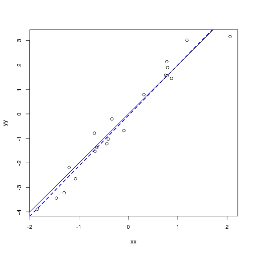
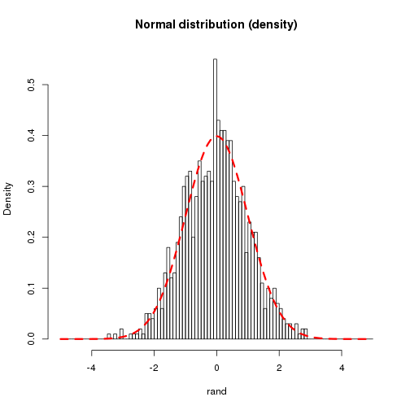
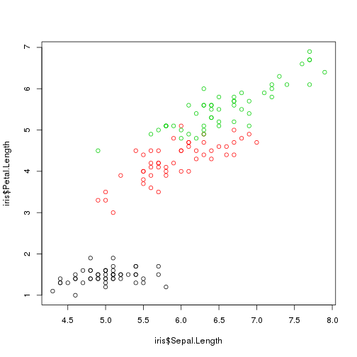
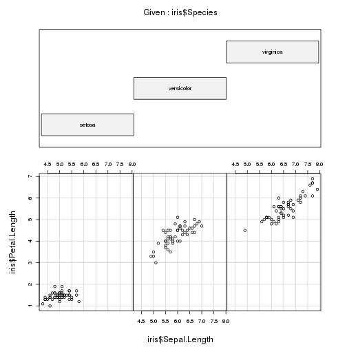

% Introduction to R and exploration of the variance
% Mathieu Basille
% February 27, 2013


<!-- R & knitr options -->


> A new statistic proves that 73\% of all statistics are pure inventions. <cite>J.J.A. Weber</cite>

This document provides the basis to use the  software. The first section is generic, and will
demonstrate the general use of the software, the different data
types[^fn1] and the available resources. The second section explore
the graphical capabilities of the software. Finally, the document
presents an exploration of the analysis of variance. For more details
about , see the
[Introduction to R](http://cran.r-project.org/doc/manuals/R-intro.pdf). The
 code used in this document can be found [here](IntroR.R).

[^fn1]: Data importation is not covered in this document.


## First use

### The R environment

 is a statistical environment based on a command-line
language.   is a free software. You can thus *freely* use
it[^fn2], *freely* distribute it, and *freely* modify and redistribute
it.

[^fn2]: Available at: [http://www.r-project.org](http://www.r-project.org)

On Windows, if we launch the software, a window opens with a console,
in which we can type in commands. A few menus are available, although
they are rarely used. A look at `Help > Console` might help.

I strongly recommend, however, to use RStudio[^fn3], a free  development environment. RStudio makes it easier to manage
code, objects, graphs, and also proposes advanced features, such as
the support of R Markdown.

[^fn3]: Available at: [http://www.rstudio.com/](http://www.rstudio.com/)


To start with, we check what is the working directory in which  started:


```r
getwd()
```


There are several methods to change this folder: among others, the
preferred approach should be the code-based approach:


```r
setwd("C:/Documents and Settings/Me/My documents/My folder")
```


The command line accepts directly all kinds of arithmetic and standard
functions:


```r
2 + 2
```

```
[1] 4
```

```r
pi
```

```
[1] 3.142
```

```r
1:5
```

```
[1] 1 2 3 4 5
```

```r
sqrt(26)
```

```
[1] 5.099
```

```r
rnorm(10)
```

```
 [1] -0.89634  0.20199 -0.08031  1.39974  0.39661 -1.15755  0.86254 -0.77200
 [9]  0.01828  0.31029
```


### Data types

In R, everything is an object: Data, functions, outputs, etc. are all
stored with the assignation command `<-`:


```r
foo <- 2 + 2
foo
```

```
[1] 4
```


`foo` is a numeric vector of length 1:


```r
class(foo)
```

```
[1] "numeric"
```

```r
length(foo)
```

```
[1] 1
```


We can associate several numbers in the same vector with the function
`c` (for "combine"):


```r
foo <- c(42, 2 + 2, sqrt(26))
foo
```

```
[1] 42.000  4.000  5.099
```

```r
class(foo)
```

```
[1] "numeric"
```

```r
length(foo)
```

```
[1] 3
```


Other common data types are matrices, data frames and lists:


```r
mat <- matrix(1:20, nrow = 5)
mat
```

```
     [,1] [,2] [,3] [,4]
[1,]    1    6   11   16
[2,]    2    7   12   17
[3,]    3    8   13   18
[4,]    4    9   14   19
[5,]    5   10   15   20
```

```r
df <- data.frame(A = 1:5, B = seq(0, 1, length.out = 5))
df
```

```
  A    B
1 1 0.00
2 2 0.25
3 3 0.50
4 4 0.75
5 5 1.00
```

```r
class(df$B)
```

```
[1] "numeric"
```

```r
lis <- list(l1 = 1:10, l2 = seq(0, 1, length.out = 5))
lis
```

```
$l1
 [1]  1  2  3  4  5  6  7  8  9 10

$l2
[1] 0.00 0.25 0.50 0.75 1.00
```


The most common structure for data is a data frame, i.e. a table with
observations as rows and variables as columns. A set of functions are
available to explore the data[^fn4]. Let's start with a simple data
frame with 20 observations over 4 variables of different types (A, B,
C and D):

[^fn4]: All these functions can be used on any data type, but will
only be demonstrated here on data frames. Feel free to explore with
other data types!


```r
df <- data.frame(A = 1:20, B = seq(0, 1, length.out = 20), C = sample(c("Big", "Medium", 
    "Small"), 20, replace = TRUE), D = rnorm(20))
head(df)
```

```
  A       B      C       D
1 1 0.00000  Small  1.7167
2 2 0.05263 Medium  0.8440
3 3 0.10526    Big  0.6585
4 4 0.15789  Small  0.3222
5 5 0.21053  Small -0.5821
6 6 0.26316 Medium  0.1629
```

```r
tail(df)
```

```
    A      B      C        D
15 15 0.7368    Big  1.14733
16 16 0.7895 Medium -1.50179
17 17 0.8421    Big -1.17762
18 18 0.8947    Big  0.23606
19 19 0.9474 Medium -0.05802
20 20 1.0000 Medium -0.56332
```

```r
str(df)
```

```
'data.frame':	20 obs. of  4 variables:
 $ A: int  1 2 3 4 5 6 7 8 9 10 ...
 $ B: num  0 0.0526 0.1053 0.1579 0.2105 ...
 $ C: Factor w/ 3 levels "Big","Medium",..: 3 2 1 3 3 2 3 3 2 1 ...
 $ D: num  1.717 0.844 0.659 0.322 -0.582 ...
```

```r
summary(df)
```

```
       A               B             C           D         
 Min.   : 1.00   Min.   :0.00   Big   :6   Min.   :-1.502  
 1st Qu.: 5.75   1st Qu.:0.25   Medium:8   1st Qu.:-0.608  
 Median :10.50   Median :0.50   Small :6   Median :-0.253  
 Mean   :10.50   Mean   :0.50              Mean   :-0.067  
 3rd Qu.:15.25   3rd Qu.:0.75              3rd Qu.: 0.705  
 Max.   :20.00   Max.   :1.00              Max.   : 1.717  
```

```r
names(df)
```

```
[1] "A" "B" "C" "D"
```

```r
dim(df)
```

```
[1] 20  4
```

```r
table(df$C)
```

```

   Big Medium  Small 
     6      8      6 
```


We can also store a function in an object:


```r
square <- function(x) print(paste("The square of", x, "is", x^2))
square(2)
```

```
[1] "The square of 2 is 4"
```


All objects are stored in the user environment. It is possible to list the objects, to remove them, or to save the complete environment for further use[^fn5].

[^fn5]: The standard behavior is to do it interactively when the user
terminates a session.


```r
ls()
```

```
[1] "df"     "foo"    "lis"    "mat"    "square"
```


```r
rm(mat)
save.image(file = "Session.RData")
```


### Need help? 

 provides a bunch of utilities to find answers: 


```r
help("sqrt")
?sqrt
help.start()
apropos("test")
help.search("Linear Model")
RSiteSearch("An Introduction to R")
```


`help` and `?` are equivalent functions to open the documentation of a
function, most often with working examples. `help.start()` opens the
documentation in HTML format directly in the browser. `apropos` looks
for every function that contains a given pattern in their
name. `help.search` search the request in the help files of the
installation. Finally, `RSiteSearch` sends the request to the browser
to search in on-line resources (mailing lists, help files, other
documents).

As of today, the best on-line resource to find answers related to a
 problem is [Rseek](http://www.rseek.org/), which is the
equivalent of `RSiteSearch` with a very detailed and user-friendly
output.


## Graphics

 has truly amazing capabilities when it comes to
graphics. In this section, I will review only simple ones, using base
functions. For more advanced users, I strongly recommend to have a
look at the `ggplot2` package[^fn6], which implements the grammar of
graphics in .

[^fn6]: See here: [http://ggplot2.org/](http://ggplot2.org/)


### Scatter plot

The most common graphical type is the 2D scatter plot, which
represents X and Y coordinates. Let's prepare 20 random x-coordinates
from a normal distribution (with mean equal to 0 and standard
deviation equal to 1). We model the y-coordinates based on the
following model:

$$x = 2 \times y + \epsilon$$

with $\epsilon$ being a noise also drawn from a normal distribution,
with mean equal to 0 and standard deviation equal to 0.5:


```r
xx <- rnorm(20)
yy <- xx * 2 + rnorm(20, 0, 0.5)
```


A scatterplot uses the generic function `plot`. We add a line with the
function `abline`, which uses an intercept (here 0) and a slope (here
2):


```r
plot(xx, yy)
abline(a = 0, b = 2)
```


We can verify the match between the observed data (i.e. the generated
data) and the model using a simple linear regression (function `lm`):


```r
plot(xx, yy)
abline(a = 0, b = 2)
lm1 <- lm(yy ~ xx)
abline(lm1, lty = 2, lwd = 2, col = "blue")
```




### Boxplots

Boxplots are made using the function `boxplot`:


```r
boxplot(df$D)
```


```r
boxplot(df$D ~ df$C)
```


### Histograms

Let `rand` be a set of 1000 random samples drawn from a normal distribution with mean equal to 0 and standard deviation equal to 1. Here is how to create a histogram of this sample:


```r
rand <- rnorm(1000)
hist(rand)
```


```r
hist(rand, main = "Normal distribution (frequency)", br = -50:50/10)
```


```r
hist(rand, main = "Normal distribution (frequency)", br = c(-5, -2, -1, -0.25, 0, 
    0.5, 1.5, 3, 5))
```


```r
hist(rand, main = "Normal distribution (density)", br = -50:50/10, freq = FALSE)
lines(-50:50/10, dnorm(-50:50/10), lwd = 3, col = "red", lty = 2)
```




### Cross graphics

Let's use the generic `plot` function on a data frame. What does it show?


```r
plot(df)
```


To understand it better, let's check the structure of the factor column:


```r
unclass(df$C)
```

```
 [1] 3 2 1 3 3 2 3 3 2 1 3 2 2 1 1 2 1 1 2 2
attr(,"levels")
[1] "Big"    "Medium" "Small" 
```


## Variance of iris

### Presentation

Let's have a look at one of the most famous data set from statistics:
the Fisher's (or Anderson's) iris data set. This data set is directly
available in  in the object `iris`. Let's check what kind of
object it is:


```r
class(iris)
```

```
[1] "data.frame"
```

```r
head(iris)
```

```
  Sepal.Length Sepal.Width Petal.Length Petal.Width Species
1          5.1         3.5          1.4         0.2  setosa
2          4.9         3.0          1.4         0.2  setosa
3          4.7         3.2          1.3         0.2  setosa
4          4.6         3.1          1.5         0.2  setosa
5          5.0         3.6          1.4         0.2  setosa
6          5.4         3.9          1.7         0.4  setosa
```

```r
str(iris)
```

```
'data.frame':	150 obs. of  5 variables:
 $ Sepal.Length: num  5.1 4.9 4.7 4.6 5 5.4 4.6 5 4.4 4.9 ...
 $ Sepal.Width : num  3.5 3 3.2 3.1 3.6 3.9 3.4 3.4 2.9 3.1 ...
 $ Petal.Length: num  1.4 1.4 1.3 1.5 1.4 1.7 1.4 1.5 1.4 1.5 ...
 $ Petal.Width : num  0.2 0.2 0.2 0.2 0.2 0.4 0.3 0.2 0.2 0.1 ...
 $ Species     : Factor w/ 3 levels "setosa","versicolor",..: 1 1 1 1 1 1 1 1 1 1 ...
```


This data set contains information measured on 50 flowers from 3
different iris species:


```r
table(iris$Species)
```

```

    setosa versicolor  virginica 
        50         50         50 
```


Detailed information is available in the help page of the data set:


```r
?iris
```


Let's check that the sepal length increases with the petal length,
whatever the species:


```r
plot(iris$Sepal.Length, iris$Petal.Length)
abline(lm(iris$Petal.Length ~ iris$Sepal.Length))
```


Is this also true for each species separately?


```r
plot(iris$Sepal.Length, iris$Petal.Length, col = as.numeric(iris$Species))
```




```r
coplot(iris$Petal.Length ~ iris$Sepal.Length | iris$Species, columns = 3)
```




### Mean comparison

Let's now look at the petal widths. Let's check if they vary by species:


```r
boxplot(iris$Petal.Width ~ iris$Species)
```


We're interested in comparing the means:


```r
mean(iris$Petal.Width[iris$Species == "setosa"])
```

```
[1] 0.246
```

```r
by(iris$Petal.Width, iris$Species, mean)
```

```
iris$Species: setosa
[1] 0.246
------------------------------------------------------------ 
iris$Species: versicolor
[1] 1.326
------------------------------------------------------------ 
iris$Species: virginica
[1] 2.026
```

```r
iris$Mean <- rep(by(iris$Petal.Width, iris$Species, mean), each = 50)
```


Based on their values only, these means seem clearly different. We can
test them 2 by 2 with *t* tests (the parameter `var.equal = TRUE`
indicates that the variances are equal within each group):


```r
t.test(iris$Petal.Width[1:50], iris$Petal.Width[51:100], var.equal = TRUE)
```

```

	Two Sample t-test

data:  iris$Petal.Width[1:50] and iris$Petal.Width[51:100] 
t = -34.08, df = 98, p-value < 2.2e-16
alternative hypothesis: true difference in means is not equal to 0 
95 percent confidence interval:
 -1.143 -1.017 
sample estimates:
mean of x mean of y 
    0.246     1.326 
```

```r
t.test(iris$Petal.Width[51:100], iris$Petal.Width[101:150], var.equal = TRUE)
```

```

	Two Sample t-test

data:  iris$Petal.Width[51:100] and iris$Petal.Width[101:150] 
t = -14.63, df = 98, p-value < 2.2e-16
alternative hypothesis: true difference in means is not equal to 0 
95 percent confidence interval:
 -0.795 -0.605 
sample estimates:
mean of x mean of y 
    1.326     2.026 
```

```r
t.test(iris$Petal.Width[1:50], iris$Petal.Width[101:150], var.equal = TRUE)
```

```

	Two Sample t-test

data:  iris$Petal.Width[1:50] and iris$Petal.Width[101:150] 
t = -42.79, df = 98, p-value < 2.2e-16
alternative hypothesis: true difference in means is not equal to 0 
95 percent confidence interval:
 -1.863 -1.697 
sample estimates:
mean of x mean of y 
    0.246     2.026 
```


Even though the difference are significant, we are limited by the
multiplication of tests (if we had 10 classes, we would have needed 45
tests!) which ends up in multiplicative risks of error.  This is why
we need to use an analysis of variance (ANOVA) that can deal with this
problem in one single test.


### Partitioning the variance

The total variance can be split in a treatment variance and an error
variance. Let's have a look at the total variance first:


```r
(totvar <- 1/nrow(iris) * sum((iris$Petal.Width - mean(iris$Petal.Width))^2))
```

```
[1] 0.5771
```


Let's compare this result with the output of the function `var`:


```r
var(iris$Petal.Width)
```

```
[1] 0.581
```

```r
totvar * nrow(iris)/(nrow(iris) - 1)
```

```
[1] 0.581
```


According to the documentation of `var`, "the denominator $n - 1$ is
     used which gives an unbiased estimator of the variance for
     i.i.d. observations." We can create a function to compute the variance with a $n$ denominator instead of $n - 1$:


```r
varN <- function(x) 1/length(x) * sum((x - mean(x))^2)
varN(iris$Petal.Width)
```

```
[1] 0.5771
```


We can now proceed with the partitioning of the variance:


```r
(treatvar <- 1/nrow(iris) * sum((iris$Mean - mean(iris$Petal.Width))^2))
```

```
[1] 0.5361
```

```r
(errvar <- 1/nrow(iris) * sum((iris$Petal.Width - iris$Mean)^2))
```

```
[1] 0.04104
```


Let's check that the total variance is equal to the sum of the other two:


```r
treatvar + errvar
```

```
[1] 0.5771
```


There is a dedicated function for an analysis of variance: the function `aov`, which gives directly the different sums of squares: 


```r
aov(iris$Petal.Width ~ iris$Species)
```

```
Call:
   aov(formula = iris$Petal.Width ~ iris$Species)

Terms:
                iris$Species Residuals
Sum of Squares         80.41      6.16
Deg. of Freedom            2       147

Residual standard error: 0.2047 
Estimated effects may be unbalanced
```


We can compute the treatment and error variances based on the sums of squares:


```r
80.41333/150
```

```
[1] 0.5361
```

```r
6.1566/150
```

```
[1] 0.04104
```


### Tests and conclusions

The contribution of the treatment variance in the total variance is given by 
$\eta^2 = V_{Treatments} / V_{Total}$:
<!-- $\eta^2 = \frac{V_{Treatments}}{V_{Total}}$ -->


```r
treatvar/totvar
```

```
[1] 0.9289
```


The actual ANOVA test can be performed with the `ANOVA` function, based on the linear model that we want to try:


```r
anova(lm(iris$Petal.Width ~ iris$Species))
```

```
Analysis of Variance Table

Response: iris$Petal.Width
              Df Sum Sq Mean Sq F value Pr(>F)    
iris$Species   2   80.4    40.2     960 <2e-16 ***
Residuals    147    6.2     0.0                   
---
Signif. codes:  0 '***' 0.001 '**' 0.01 '*' 0.05 '.' 0.1 ' ' 1 
```


*Conclusions?*


## R session information


```
R version 2.15.2 (2012-10-26)
Platform: x86_64-pc-linux-gnu (64-bit)

attached base packages:
[1] stats     graphics  grDevices utils     datasets  methods   base     

other attached packages:
[1] codetools_0.2-8     knitcitations_0.3-3 bibtex_0.3-5       
[4] knitr_1.0.5         basr_0.5.1         

loaded via a namespace (and not attached):
 [1] compiler_2.15.2 digest_0.6.1    evaluate_0.4.3  formatR_0.7    
 [5] fortunes_1.4-2  RCurl_1.95-3    stringr_0.6.2   tools_2.15.2   
 [9] XML_3.9-4       xtable_1.5-6   
```

